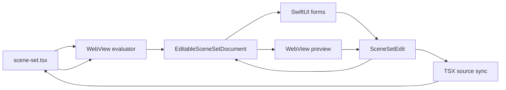

# Live Editor Model

GitCI Screens should let users author scene sets as React-flavored TSX while editing them through native SwiftUI controls. The TSX remains the human-readable source of truth, but the app works with a structured, revisioned edit model.

## Source Of Truth

A scene set can be represented by two files:

- `scene-set.gitci.json`: stable manifest index with `id`, `entry`, and `export`
- `scene-set.tsx`: authored React mini DSL

The app loads the manifest, evaluates the TSX in a sandboxed WebView authoring runtime, and receives a `SceneSetManifest` shape Swift can validate, inspect, edit, and plan.

The user should not have to maintain redundant JSON. JSON is either a tiny index file or generated build output.

## Editing Loop

The native editor keeps an `EditableSceneSetDocument`:

- `sceneSet`: evaluated scene-set model
- `revision`: monotonic edit counter

SwiftUI controls emit `SceneSetEdit` values against stable semantic paths:

- `slotID`
- `variantID`
- `propPath`

Example:

```swift
.setVariantProp(
    slotID: "hero",
    variantID: "default",
    path: ["headline"],
    value: .string("Read anything faster")
)
```

This updates Swift state immediately. The preview can be refreshed from the edited model while source syncing runs separately.

## Two-Way Sync

The intended editor runtime has four synchronized views of the same scene set:

1. TSX source text
2. evaluated Swift model
3. SwiftUI forms / WYSIWYG controls
4. WebView preview

The app should treat edits as transactions:



The preview should be optimistic: apply edits to the structured model and preview immediately, then reconcile if source rewriting fails.

## TSX Rewriting Strategy

The authoring DSL should stay intentionally regular so source edits are practical:

```tsx
<Scene
  id="default"
  template="gitci.core.keyword-cards"
  headline="Read what you love"
  screenshot={asset('../../assets/iphone/reader.png')}
/>
```

For the first implementation, only rewrite simple literals and object props that the authoring harness can locate safely. If a prop is computed, imported, spread from another object, or built by arbitrary code, mark it read-only in forms and let the source editor handle it.

Later the WebView authoring harness should return source bindings:

```json
{
  "slotID": "hero",
  "variantID": "default",
  "propPath": ["headline"],
  "sourceRange": {
    "file": "scene-set.tsx",
    "startOffset": 184,
    "endOffset": 205
  },
  "editable": true
}
```

Swift can then rewrite exact ranges and ask the evaluator to re-materialize the scene set. This preserves React authoring ergonomics while giving SwiftUI a stable form model.

## WYSIWYG Behavior

Canvas selection should also emit the same edit operations. For example, clicking a keyword card in preview can select `slotID=hero`, `variantID=default`, `propPath=["keywords", "0", "label"]` once list-index paths are supported.

The app should support:

- select scene slot
- switch selected variant
- edit text props
- pick assets
- edit theme overrides
- toggle target inclusion
- preview light/dark and target sizes

The editor should avoid hiding code. A user can always open the TSX source pane, and form edits should show as real source edits rather than opaque app database state.
